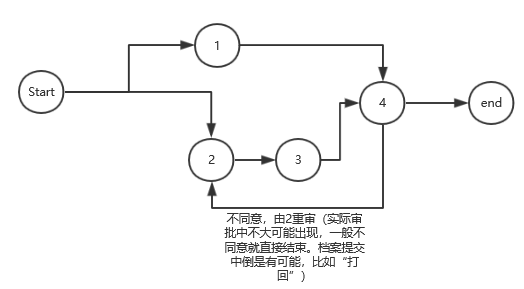
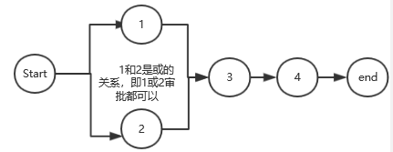
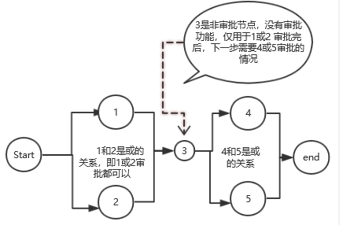

# 审批流
审批流的定义重点还在界面拖拽，理同自定义界面。或者不使用拖拽，通过用户对各节点的定义，自动生成流程图，这个更简单

## 表结构
### ProcessTemplate

FieldName | Type | Description
----------|------|------------
id | int | id
processName | string | process name,如：机密档案借阅审批流程
processType | int | 1-借阅审批，2-销毁审批...
### NodeTemplate
FieldName | Type | Description
----------|------|------------
id | int | node id，审批节点ID
type | int | 0.无功能节点  1.审批节点
pid | int | process id
preID | int | 上一节点，0为开始节点
nodeName | string | node name
approver | string | 审批者，角色或员工ID列表。如：1，2表示1和2都要审批才能通过，或的关系通过多个子节点来表示
approveNext | string | node id 列表，审批通过，下一步转向哪些IDs的node。如果值为999：审批通过并结束
rejectNext | string | node id 列表，审批不通过，下一步转向哪些IDs的node。如果值为-1：审批不通过并结束

### apply
申请表  

FieldName | Type | Description
----------|------|------------
id | int | id
pid | int | process id
aplicant | string | 申请人ID
applyData | string | 要申请的数据
other | none | 其他字段，待定

### approve
审批表   

FieldName | Type | Description
----------|------|------------
id | int | id
nid | int | node id，审批节点ID
aid | int | apply id(申请ID)
approver | string | 审批人ID
approveResult | int | 1.approved -1.rejected
approveApinion | string | 审批意见
other | none | 其他字段，待定

### 可实现类似以下结构流程
  
  
  